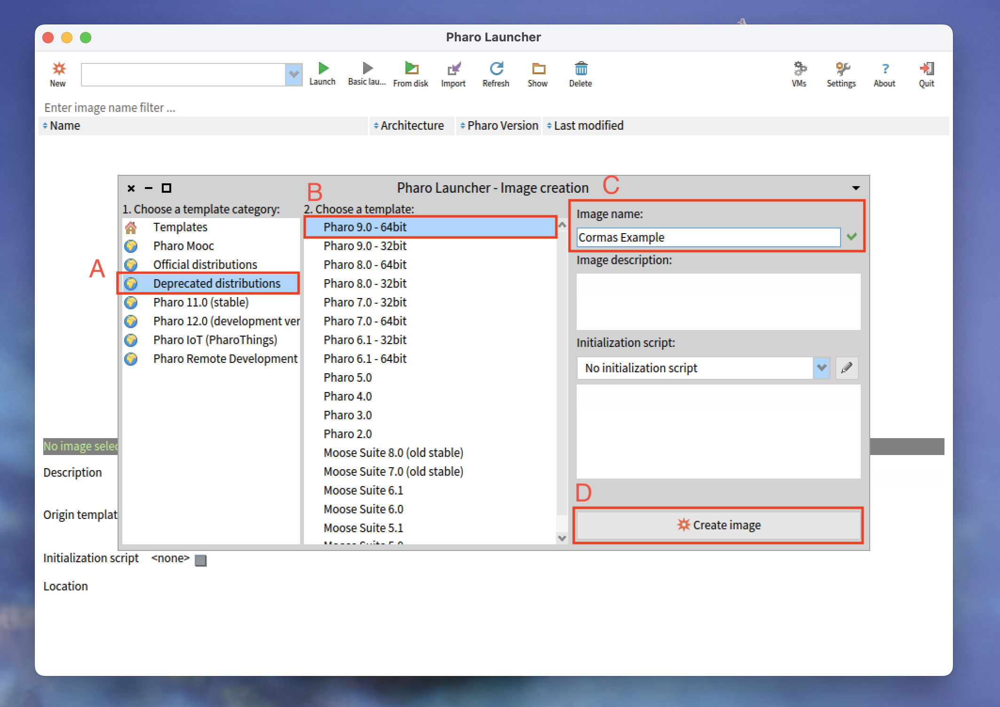
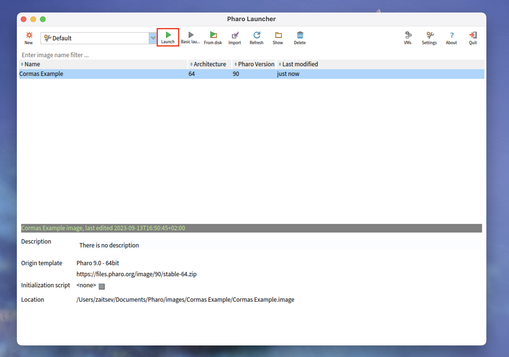
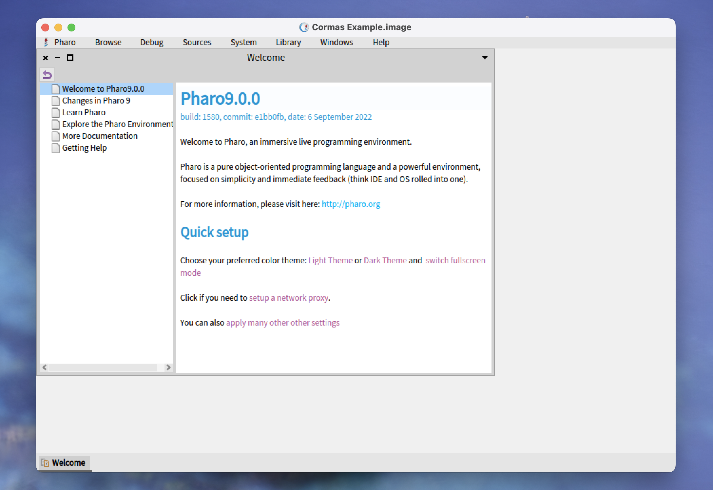
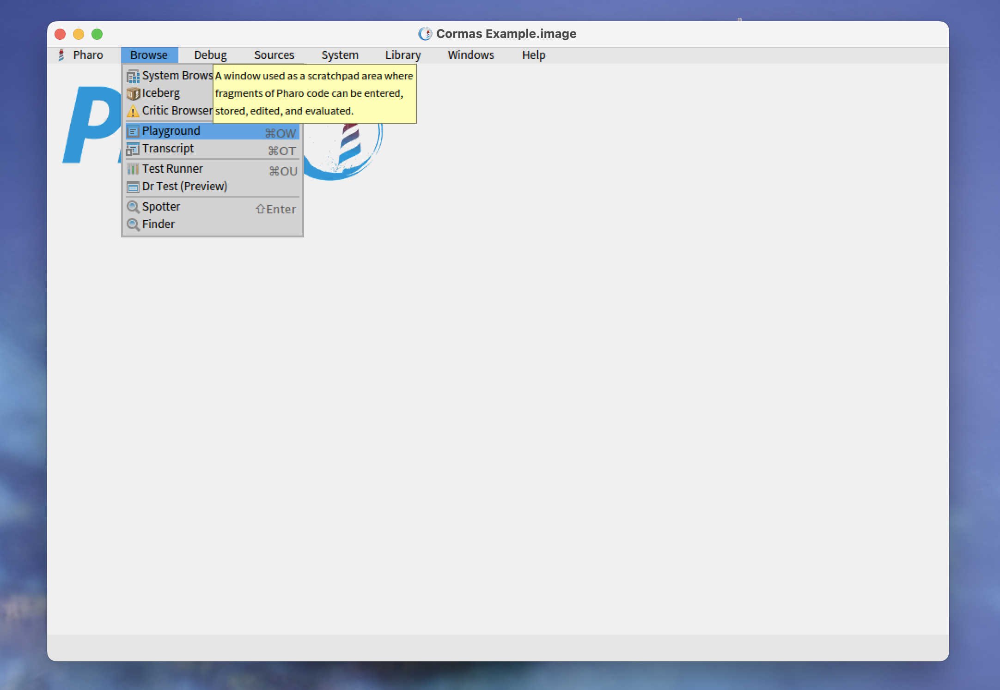
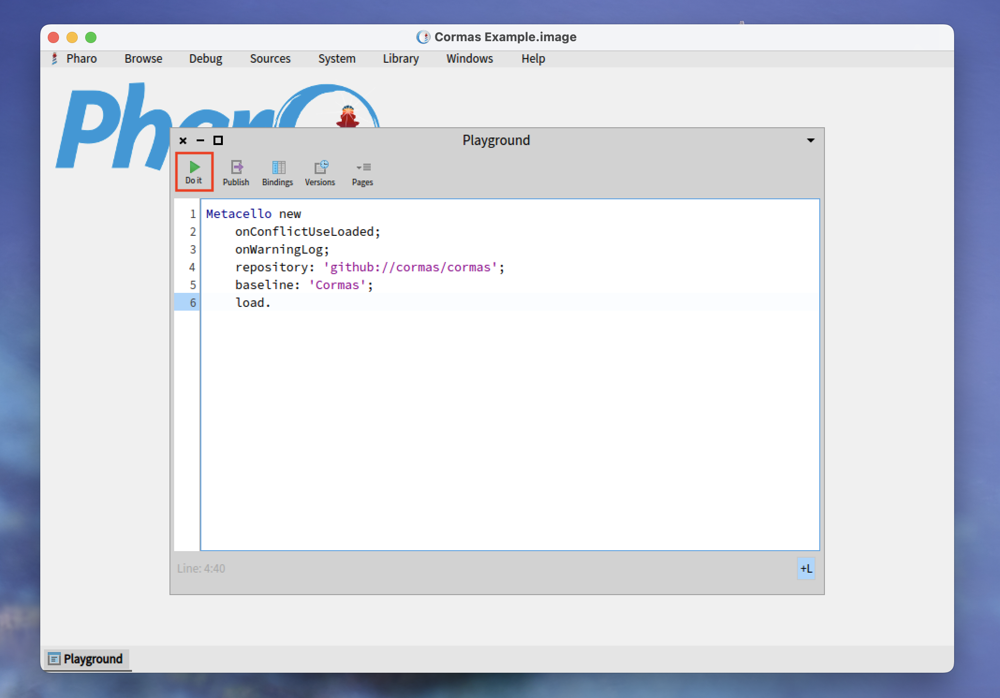
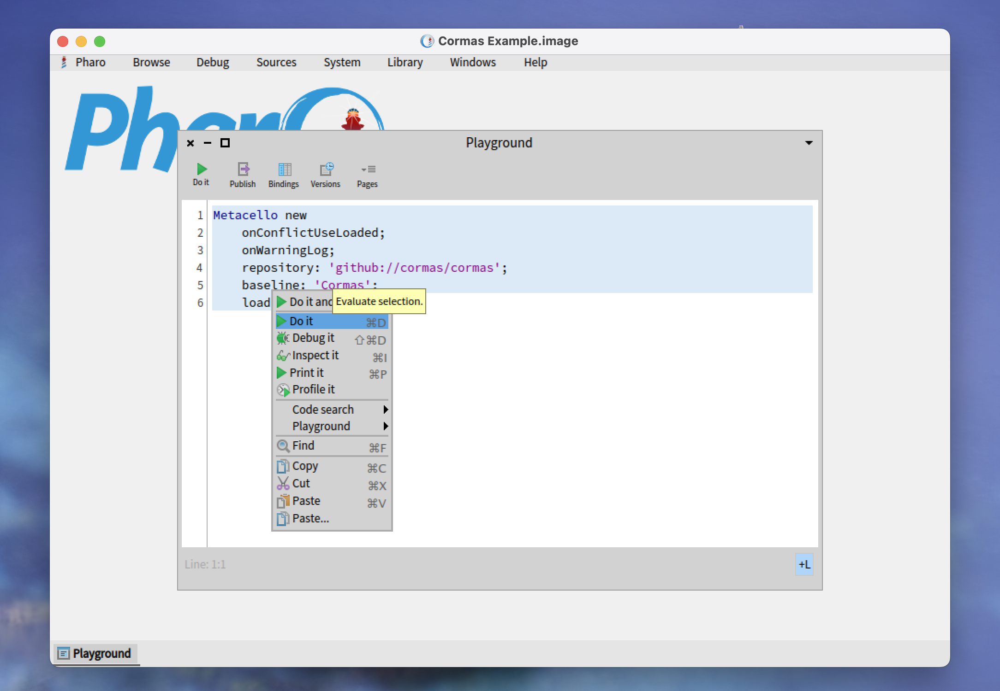

# How to Install Cormas in Pharo 9

[Cormas](https://github.com/cormas/cormas) is an agent-based modelling platform implemented in [Pharo](https://pharo.org/).
It is highly interactive and particularly well-suited  for participatory modelling.
In this post, I provide the step-by-step instructions for loading the core packages of Cormas into Pharo 9.

## Contents

- [Step 1. Install Pharo Launcher](#step-1-install-pharo-launcher)
- [Step 2. Create and Open a Pharo Image](#step-2-create-and-open-a-pharo-image)
- [Step 3. Install Cormas Core](#step-3-install-cormas-core)
- [Step 4.Try It Out](#step-4-try-it-out)

## Step 1. Install Pharo Launcher

Pharo Launcher is an application that can be used for creating and managing Pharo images. It can be downloaded from [https://pharo.org/download](https://pharo.org/download).
Follow the instructions on the website to install Pharo Launcher on your computer.
Once the installation is over, open Pharo Launcher.
You should see the window similar to this:


## Step 2. Create and Open a Pharo Image

To create a new Pharo image, click on the _"New"_ button in the top-left corner of the Pharo Launcher window.


Now you must select the version of Pharo and give your image a name.
The current version of Cormas requires Pharo 9, which is a deprecated version of Pharo.
Therefore, you must first click on the _"Deprecated distributions"_ (A), then select _"Pharo 9.0 - 64bit"_ from the list (B).
In text edit field (C), Pharo Launcher will suggest you a standard image name, for example, _"Pharo 9.0 - 64bit"_.
We strongly recommend that you always replace it with a meaningful name that describes the purpose of your image.
In this case, we use the name _"Cormas Example"_. 
Once you have selected the version and given your image a name, click on the _"Create image"_ button in the bottom-right corner (D).



Now select your newly created image in the list and click on the _"Launch"_ button.
You can also double-click on your image or right-click on it and select _"Launch"_ in the context menu.

 

Once your new image opens, it should look like the one in the picture below.
The _"Welcome Window"_ allows you to make some basic configurations (e.g., choose the Dark Theme), it also contains many useful links that can help you learn Pharo.
Once you have familiarized yourself with the _"Welcome Window"_, feel free to close it and continue this tutorial.

 

## Step 3. Install Cormas Core

We will install Cormas into this image by executing the installation script.
To do that, you must open the Playground - a standard Pharo tool for executing code.
We do not program in Playground (for that, we use the System Browser), but we often use it to play with things, and run different scripts such as the installation script that you will see below.

To open the Playground, click on `Browse > Playground` in the menu above.
You can also use the keyboard shortcut `Ctrl+OW` (if you are using Mac, the shortcut is `Cmd+OW`).

 

Copy the following installation script into your Playground.

```st
Metacello new
    onConflictUseLoaded;
    onWarningLog;
    repository: 'github://cormas/cormas';
    baseline: 'Cormas';
    load.
```
You do not really need to understand this script, but in case you are interested, it specifies that we want to load [Cormas](https://github.com/cormas/cormas) project from GitHub.
The version is specified as [v0.5](https://github.com/cormas/cormas/releases/tag/v0.5).
The baseline (installation configuration in the repository) is `Cormas` ([BaselineOfCormas](https://github.com/cormas/cormas/blob/v0.5/repository/BaselineOfCormas/BaselineOfCormas.class.st)).
`onConflictUseLoaded` means that in case some of the dependencies are already loaded, we will not load them again.
`onWarningLog` means that any installation warnings will be logged and not displayed to you.
If you want to learn more about baselines and Metacello, check out the [Baselines](https://github.com/pharo-open-documentation/pharo-wiki/blob/master/General/Baselines.md) tutorial on [Pharo Wiki](https://github.com/pharo-open-documentation/pharo-wiki/blob/master/README.md).

To execute all the code in your Playground, click on the _"Do It"_ button in the top-left corner.



You can also execute only the selected lines.
To do that, highlight them and, right-click on this selection and select _"Do It"_ in the context menu.
Alternatively, you can use the shortcut `Ctrl+D` (or `Cmd+D` on Mac).



The installation can take several minutes to complete.
Once it is over, proceed to the next step.

## Step 4. Try It Out

Cormas is now installed and ready to be used.

