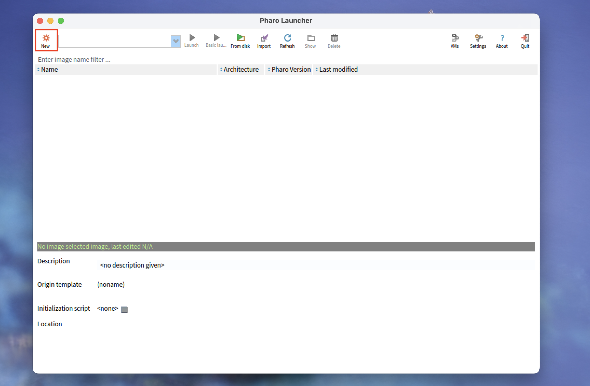
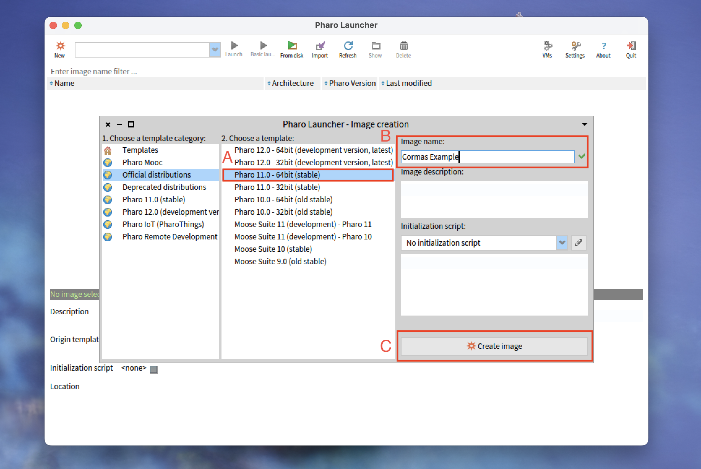
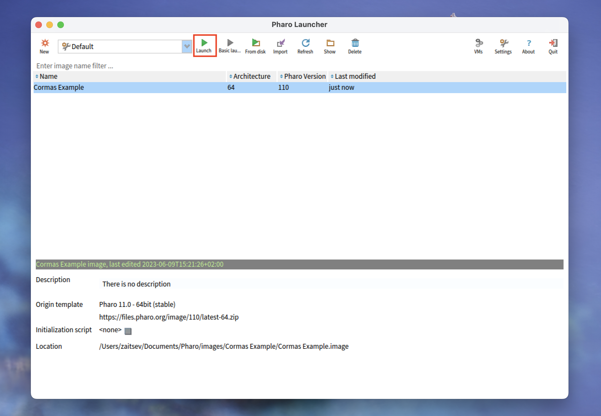
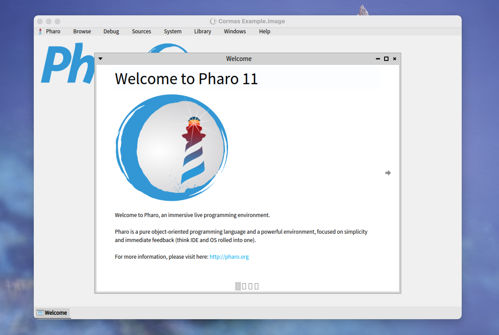
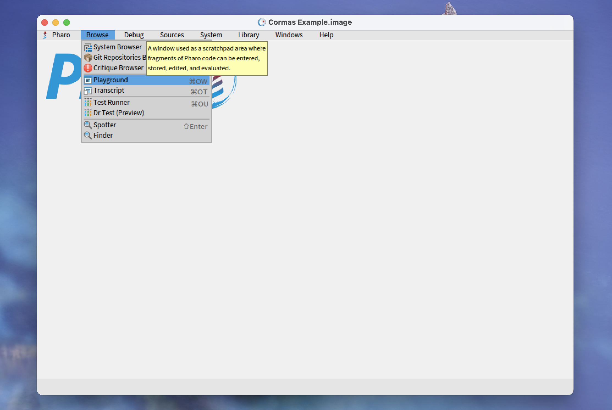
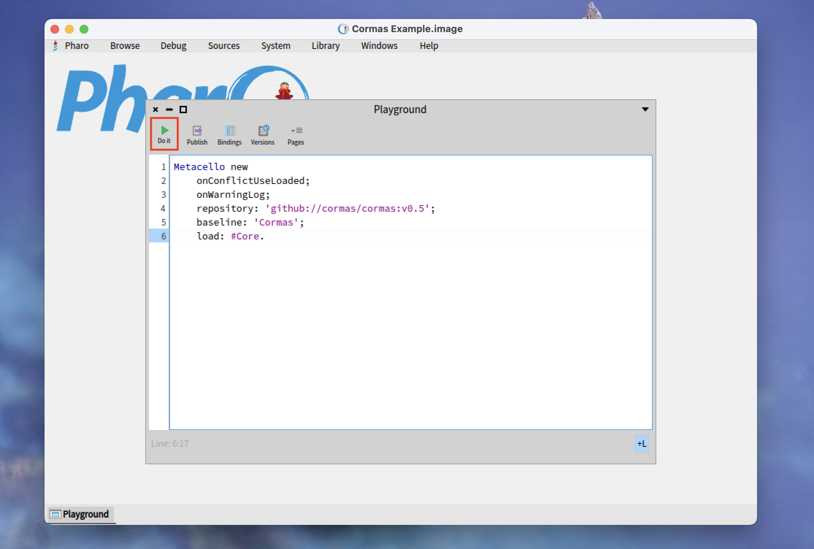
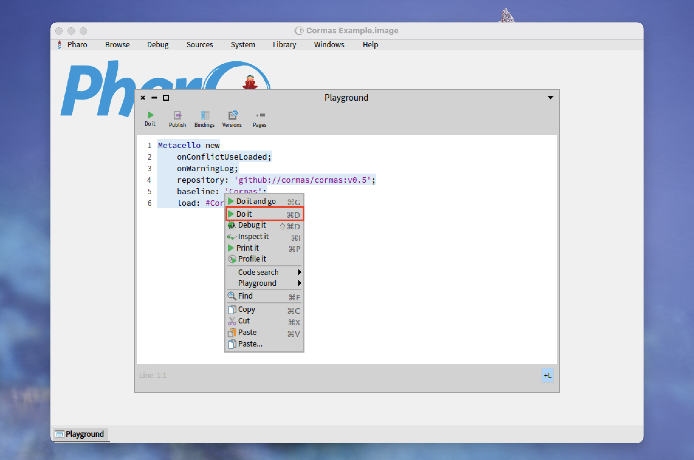

# How to Load and Use the Core Packages of Cormas in Pharo 11

Cormas is an agent-based modelling platform implemented in Pharo.
It is highly interactive and particularly well-suited  for participatory modelling.
At the time of writing, the latest version of Cormas is only compatible with Pharo 9, which is an old and deprecated version of Pharo.
However, the Core packages of Cormas (without graphical user interface) can be loaded separately and used in any modern version of Pharo.

In this post, I provide the step-by-step instructions for loading the core packages of Cormas into Pharo 11 and using them to run multi-agent simulations in Pharo Playground.

## Step 1. Install Pharo Launcher

Pharo Launcher is an official application that can be used for creating and managing Pharo images. It can be downloaded from [https://pharo.org/download](https://pharo.org/download).
Follow the instructions on the website to install Pharo Launcher on your computer.
Once the installation is over, open Pharo Launcher.
You should see the window similar to this:


## Step 2. Create and Open a Pharo 11 Image





 

 

## Step 3. Install Cormas Core

 

```st
Metacello new
    onConflictUseLoaded;
    onWarningLog;
    repository: 'github://cormas/cormas:v0.5';
    baseline: 'Cormas';
    load: #Core.
```




## Step 4. Install a Model

```st
"Load the SEIR model"
Metacello new
    onConflictUseLoaded;
    baseline: 'REDModel';
    repository: 'github://olekscode/REDEpidemiologicalModel';
    load.
```

## Step 5. Browse and Edit the Model

## Step 6. Run the Simulation

```st
"Initialize the model"
model := REDModel new.
model initSimulation.

"Run simulation for 730 days"
(1 to: 730)
    do: [ :step | model runStep ]
    displayingProgress: [ :step | 'Simulation step ', step asString ].
    
"Inspect the model"
model inspect.
```